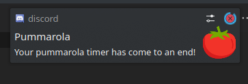

# pummarola
A discord simple yet useful pomodoro timer


## Usage

### Self-hosted

First install dependencies wit pip:

```
pip install -r requirements.txt
```

then add your token inside the `./src/config.toml` file:

```toml
token = "xxxxxxxxxxxxxxxxxxxxxxxxxxxxxxxx"
```

once done, launch the bot:

```
python pummarola.py
```

## Commands

* `!pummarola -h` displays a list of commands
* `!pummarola --help` displays a list of commands
* `!pummarola` starts a default 5 minutes pomodoro timer
* `!pummarola X` starts a custom pomodoro timer where X = seconds

## Output

Once the timer is finished, pummarola will send you a private message:


aswell as a notification, if you got those enabled:



Also, when invoking `-h` or `--help` the bot will reply with a list of commands in the same channel you invoked it:

